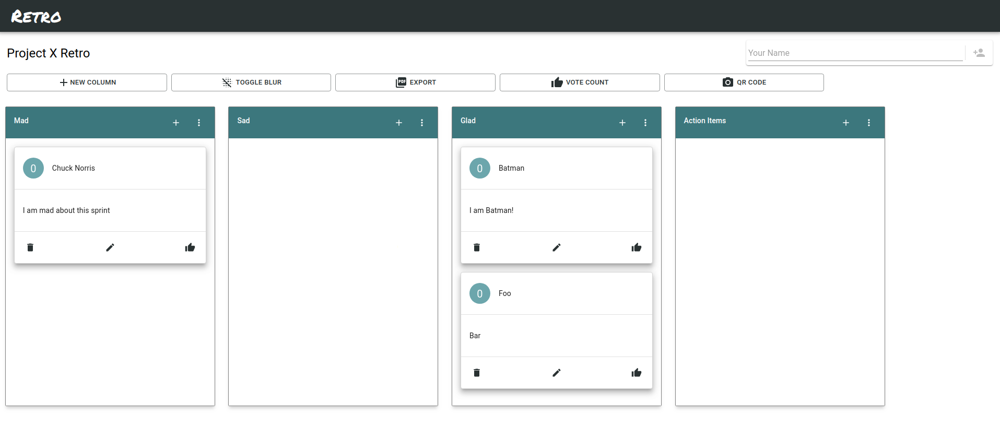

# Retro - Make Retrospectives Great Again


   [](https://github.com/prettier/prettier)

Retro is a tool that you can use for your retrospectives. The goal of Retro is to aid teams in remote retrospectives.



## Intent

At work, we were using third party retrospective tools, which meant we couldn't express ourselves freely because of privacy reasons. Retro provides an open-source solution, where you can host the app on your own servers, so you can discuss freely again, since you own the data!

## Usage Locally

### Install Dependencies

```bash
$ cd backend && yarn && cd ..
$ cd frontend && yarn && cd ..
```

### Run Servers

```bash
$ cd backend && yarn start && cd ..
$ cd frontend && yarn start && cd ..
```

After starting the servers, visit `localhost:3000` to use the app.

### Board Data

The board data lives currently inside `backend/storage`. All boards have an unique ID and are saved as `<board_id>.json`. The exports are saved as `<board_id>.png`.

## A deployment example with PM2

- Install PM2 on your server with `npm i -g pm2`
- Clone the project (master branch) on your server
- Install the dependencies by running `yarn` on both projects
- Check if the proxy settings are correct
  - Check `backend/src/config/config.js`
  - Check proxy field on `frontend/package.json`
  - Check backend path on `frontend/src/utils/index.js`
- Provide an `.env.production.local` file and put it inside of `frontend`
    ```
    # Example
    REACT_APP_PROD_URL=http://mydomain.com
    REACT_APP_PROD_PORT=80
    ```
- Build the Frontend by running `yarn deploy`
  - This command builds the frontend and copies the built files to `backend/public`
- Go to the `backend` folder and run `pm2 start processes.json`

## Contributing

- Please use [Yarn](https://yarnpkg.com/lang/en/) & [Prettier](https://prettier.io)
- Test your stuff manually or better, provide tests
- If you developed a whole user scenario, then please provide E2E tests

## Project State

- You can always watch the current state of the project at [Trello](https://trello.com/b/AhEZ0aLs/retro)
