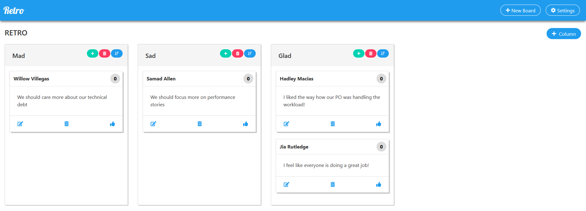

# Retro - Make Retrospectives Great Again

The goal of Retro is to have a good UX in retrospectives with distributed teams.

## Backend

- Node.js Server using [Express](http://expressjs.com) and [Socket.IO](https://socket.io/)

## Frontend

- React App along with 
  - [Bulma](https://bulma.io/)
  - [react-beautiful-dnd](https://github.com/atlassian/react-beautiful-dnd)
  - [react-responsive-modal](https://react-responsive-modal.leopradel.com/)
  - [styled-components](https://www.styled-components.com/)

## Development

| Intent          | Action                               |
| --------------- | ------------------------------------ |
| run backend     | `cd backend && yarn start`           |
| run frontend    | `cd frontend && yarn start`          |
| build frontend  | `cd frontend && yarn build`          |
| deploy frontend | `cd scripts && sh deployFrontend.sh` |
