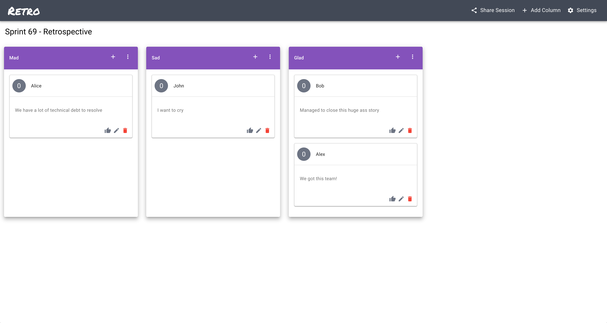
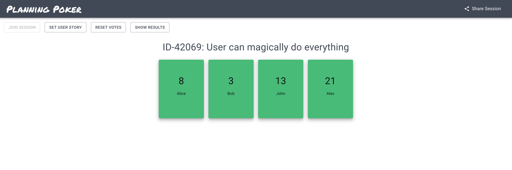

# Retro - Make Retrospectives Great Again

   [](https://github.com/prettier/prettier)

## What is Retro?

Retro is a tool that you can use for retrospectives and planning poker sessions. The goal of Retro is to aid teams in remote retrospectives.

At work, we were using third party retrospective tools, which meant we couldn't express ourselves freely because of privacy reasons. Retro provides an open-source solution, where you can host the app on your own servers, so you can discuss freely again, since you own the data.

## Example - Retrospective



## Example - Planning Poker



## Requirements

- Latest Node.js LTS version
- NPM version >= 7

## Usage Locally

Install dependencies

```console
$ cd backend && npm i && cd ..
$ cd frontend && npm i && cd ..
```

Run servers

```console
$ cd backend && npm run start:dev && cd ..
$ cd frontend && npm run start && cd ..
```

## Branching

- The `master` branch is the latest development stage
- Stable releases are tagged with their respective version number
- There might be feature branches that contain new experimental stuff

## Deployment Examples

### PM2

- Install [PM2](https://pm2.keymetrics.io/) on your server
- Clone this project on your server
- Install the dependencies by running `npm i` on `backend` and `frontend`
- Check if the proxy settings are correct
  - Check `backend/src/config/index.ts`
  - Check `frontend/src/setupProxy.js`
  - Check `frontend/src/utils/index.ts`
- Provide an `.env.production.local` file inside of `frontend`
  ```
  # Example
  REACT_APP_PROD_URL=http://mydomain.com
  REACT_APP_PROD_PORT=80
  ```
- Build the frontend by running `npm run deploy`
- Go to the `backend` folder and run `pm2 start processes.json`

### Docker

- There is a `Dockerfile` on the project root which builds everything and runs the server
- You might want to define your own restart policy then
- The server runs without process managers. You can read [here](https://www.docker.com/blog/keep-nodejs-rockin-in-docker/) why.

## Contributing

- This project uses
  - [Prettier](https://prettier.io)
  - LTS version of [Node.js](https://nodejs.org/en/)
  - [Conventional Commits](https://www.conventionalcommits.org/)
- You can also develop with the provided Docker containers!
  - on Linux, make sure to set an environment variable, since `host.docker.internal` is not working:
    - `export DOCKER_HOST_IP=$(docker network inspect bridge --format='{{(index .IPAM.Config 0).Gateway}}')`

## Project State

- You can always watch the current state of the project at [Trello](https://trello.com/b/AhEZ0aLs/retro)

## Contributors ✨

Thanks goes to these wonderful people ([emoji key](https://allcontributors.org/docs/en/emoji-key)):

<!-- ALL-CONTRIBUTORS-LIST:START - Do not remove or modify this section -->
<!-- prettier-ignore-start -->
<!-- markdownlint-disable -->
<table>
  <tr>
    <td align="center"><a href="https://yduman.github.io/"><br /><sub><b>Yadullah Duman</b></sub></a><br /><a href="https://github.com/yduman/retro/commits?author=yduman" title="Code">💻</a> <a href="#maintenance-yduman" title="Maintenance">🚧</a> <a href="#projectManagement-yduman" title="Project Management">📆</a> <a href="https://github.com/yduman/retro/pulls?q=is%3Apr+reviewed-by%3Ayduman" title="Reviewed Pull Requests">👀</a> <a href="#ideas-yduman" title="Ideas, Planning, & Feedback">🤔</a></td>
    <td align="center"><a href="https://github.com/mrpatpat"><br /><sub><b>Adrian Endrich</b></sub></a><br /><a href="https://github.com/yduman/retro/commits?author=mrpatpat" title="Code">💻</a></td>
    <td align="center"><a href="https://github.com/ClaasBusemann"><br /><sub><b>Claas Busemann</b></sub></a><br /><a href="https://github.com/yduman/retro/commits?author=ClaasBusemann" title="Code">💻</a></td>
    <td align="center"><a href="https://github.com/PaulaBre"><br /><sub><b>PaulaBre</b></sub></a><br /><a href="https://github.com/yduman/retro/commits?author=PaulaBre" title="Code">💻</a></td>
    <td align="center"><a href="https://github.com/tobim-dev"><br /><sub><b>Tobias</b></sub></a><br /><a href="https://github.com/yduman/retro/commits?author=tobim-dev" title="Code">💻</a></td>
    <td align="center"><a href="https://github.com/ravensinth"><br /><sub><b>ravensinth</b></sub></a><br /><a href="https://github.com/yduman/retro/commits?author=ravensinth" title="Code">💻</a></td>
    <td align="center"><a href="https://github.com/2mawi2"><br /><sub><b>Marius Wichtner</b></sub></a><br /><a href="https://github.com/yduman/retro/commits?author=2mawi2" title="Code">💻</a></td>
  </tr>
</table>

<!-- markdownlint-enable -->
<!-- prettier-ignore-end -->

<!-- ALL-CONTRIBUTORS-LIST:END -->

This project follows the [all-contributors](https://github.com/all-contributors/all-contributors) specification. Contributions of any kind welcome!
