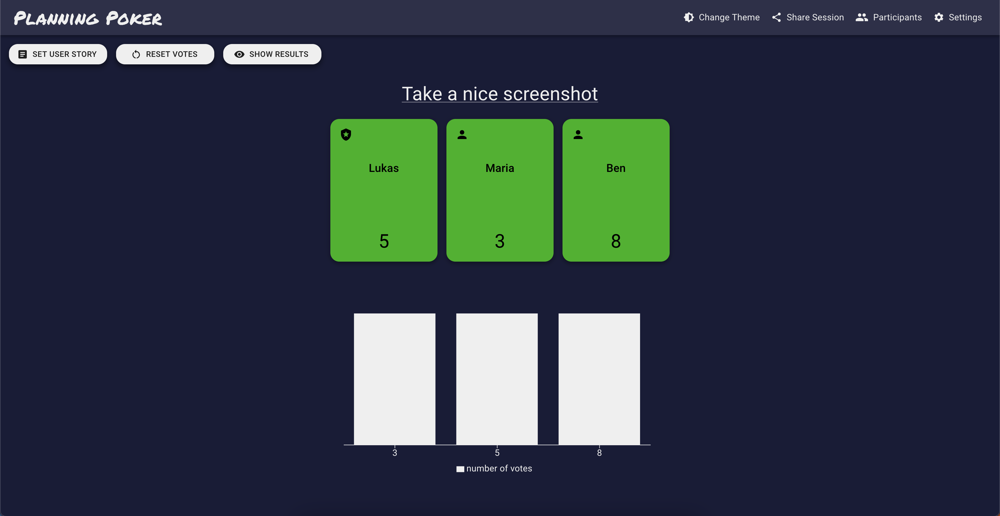

# Retro - Reflect, Refine, Repeat

   

## What is Retro?

Retro is a tool that is used for retrospectives and planning poker sessions. The goal of Retro is to have an easy to use
and secure way of having retro and planning poker sessions.

Retro uses a peer-to-peer approach, where all communication including retro and poker information is shared between
users only and never reaches a backend server. The backend server is only used for signaling, which is the initial
handshake between the participants in a room. This is possible by following the [WebRTC](https://webrtc.org/) protocol.

## Retrospective

## Planning Poker

## Requirements

- Latest Node.js LTS version
- NPM version >= 7

## Hosting

This application requires three services to be running and configured correctly.

| Docker image                                                       | Exposed port |
| ------------------------------------------------------------------ | ------------ |
| [Retro Frontend](https://hub.docker.com/r/retroapp/retro-frontend) | 80           |
| [Retro Backend](https://hub.docker.com/r/retroapp/retro-backend)   | 3001         |
| [Signaling Server](https://hub.docker.com/r/peerjs/peerjs-server)  | 9000         |

### WebRTC

By default, the clients identify the IP address of the other peers by using a public STUN server by Google. A TURN
server is not provided by default and must be hosted additionally. The frontend can be configured to overwrite the ice
server urls.

### Environment variables example

#### Frontend

- RETRO_MAX_VOTE_COUNT = 3
- BACKEND_PROTOCOL = "https"
- BACKEND_HOST = "my-api-domain.com"
- BACKEND_PORT = 443
- SIGNALING_SERVER_PROTOCOL = "https"
- SIGNALING_SERVER_HOST = "my-signaling-domain.com"
- SIGNALING_SERVER_PORT = 443
- ICE_SERVER_URLS = "stun:stun.l.google.com:19302,user:password@turn:test.turn.server:1914"

#### Backend

- CORS_ORIGIN = "my-api-domain.com,my-signaling-domain.com"

## Development

Quick start guide can be found [here](./documentation/development.md)

## Contributing

For information on how to contribute,
see [Contributing](https://github.com/MaibornWolff/retro/blob/master/CONTRIBUTING.md)

## Contributors ✨

Thanks goes to these wonderful people ([emoji key](https://allcontributors.org/docs/en/emoji-key)):

<!-- ALL-CONTRIBUTORS-LIST:START - Do not remove or modify this section -->
<!-- prettier-ignore-start -->
<!-- markdownlint-disable -->
<table>
  <tbody>
    <tr>
      <td align="center" valign="top" width="14.28%"><a href="https://github.com/mrpatpat"> <b>Adrian Endrich</b></a> <a href="https://github.com/MaibornWolff/retro/commits?author=mrpatpat" title="Code">💻</a></td>
      <td align="center" valign="top" width="14.28%"><a href="https://github.com/NearW"> <b>Ben Willenbring</b></a> <a href="https://github.com/MaibornWolff/retro/commits?author=NearW" title="Code">💻</a> <a href="#ideas-NearW" title="Ideas, Planning, & Feedback">🤔</a> <a href="#maintenance-NearW" title="Maintenance">🚧</a> <a href="#projectManagement-NearW" title="Project Management">📆</a></td>
      <td align="center" valign="top" width="14.28%"><a href="https://github.com/ClaasBusemann"> <b>Claas Busemann</b></a> <a href="https://github.com/MaibornWolff/retro/commits?author=ClaasBusemann" title="Code">💻</a></td>
      <td align="center" valign="top" width="14.28%"><a href="https://github.com/sillydomnom"> <b>Dominik Schumann</b></a> <a href="https://github.com/MaibornWolff/retro/commits?author=sillydomnom" title="Code">💻</a></td>
      <td align="center" valign="top" width="14.28%"><a href="https://github.com/dostulataa"> <b>Lukas Richter</b></a> <a href="https://github.com/MaibornWolff/retro/commits?author=dostulataa" title="Code">💻</a> <a href="#ideas-dostulataa" title="Ideas, Planning, & Feedback">🤔</a> <a href="#maintenance-dostulataa" title="Maintenance">🚧</a> <a href="#projectManagement-dostulataa" title="Project Management">📆</a></td>
      <td align="center" valign="top" width="14.28%"><a href="https://github.com/Hall-Ma"> <b>Maria Hallmann</b></a> <a href="https://github.com/MaibornWolff/retro/commits?author=Hall-Ma" title="Code">💻</a> <a href="https://github.com/MaibornWolff/retro/commits?author=Hall-Ma" title="Tests">⚠️</a></td>
      <td align="center" valign="top" width="14.28%"><a href="https://github.com/2mawi2"> <b>Marius Wichtner</b></a> <a href="https://github.com/MaibornWolff/retro/commits?author=2mawi2" title="Code">💻</a></td>
    </tr>
    <tr>
      <td align="center" valign="top" width="14.28%"><a href="https://github.com/xWorkerBeex"> <b>Martin Schröder</b></a> <a href="https://github.com/MaibornWolff/retro/commits?author=xWorkerBeex" title="Code">💻</a></td>
      <td align="center" valign="top" width="14.28%"><a href="https://github.com/PaulaBre"> <b>PaulaBre</b></a> <a href="https://github.com/MaibornWolff/retro/commits?author=PaulaBre" title="Code">💻</a></td>
      <td align="center" valign="top" width="14.28%"><a href="https://github.com/tobim-dev"> <b>Tobias</b></a> <a href="https://github.com/MaibornWolff/retro/commits?author=tobim-dev" title="Code">💻</a></td>
      <td align="center" valign="top" width="14.28%"><a href="https://yduman.github.io/"> <b>Yadullah Duman</b></a> <a href="https://github.com/MaibornWolff/retro/commits?author=yduman" title="Code">💻</a> <a href="https://github.com/MaibornWolff/retro/pulls?q=is%3Apr+reviewed-by%3Ayduman" title="Reviewed Pull Requests">👀</a> <a href="#ideas-yduman" title="Ideas, Planning, & Feedback">🤔</a></td>
      <td align="center" valign="top" width="14.28%"><a href="https://github.com/ravensinth"> <b>ravensinth</b></a> <a href="https://github.com/MaibornWolff/retro/commits?author=ravensinth" title="Code">💻</a></td>
        <td align="center" valign="top" width="14.28%"><a href="https://github.com/Nomandes"> <b>Manuel Lehé</b></a> <a href="https://github.com/MaibornWolff/retro/commits?author=Nomandes" title="Code">💻</a></td>
    </tr>
  </tbody>
</table>

<!-- markdownlint-restore -->
<!-- prettier-ignore-end -->

<!-- ALL-CONTRIBUTORS-LIST:END -->

This project follows the [all-contributors](https://github.com/all-contributors/all-contributors) specification.
Contributions of any kind welcome!
